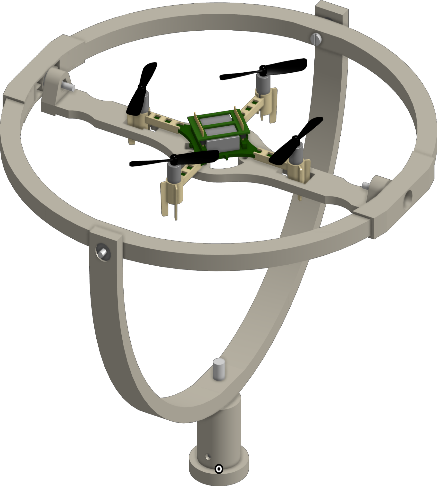
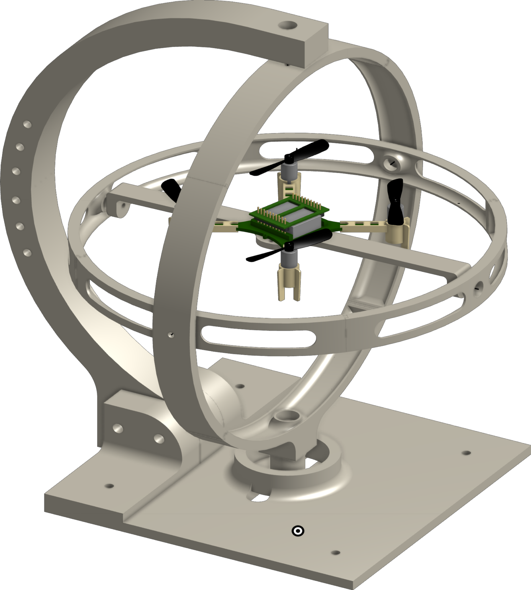

# OpenGimbal

If you do end up using the platform for research then you can cite us using the details below:

@ARTICLE{10225720, author={Sharma, Suryansh and Dijkstra, Tristan and Prasad, Ranga Venkatesha}, journal={IEEE Sensors Letters}, title={Open Gimbal: A 3 Degrees of Freedom Open Source Sensing and Testing Platform for Nano- and Micro-UAVs}, year={2023}, volume={7}, number={9}, pages={1-4}, doi={10.1109/LSENS.2023.3307121}}

OpenGimbal is a specially designed 3 DoF test bench that caters to the unique requirements of mUAVs and nUAVs. This test bench allows for unrestricted rotational motion, enabling comprehensive experimentation and evaluation of these UAVs. Our approach focuses on simplicity and accessibility. We developed an open-source, 3D printable electro-mechanical  design that emphasizes minimal size and complexity. This design facilitates easy replication and customization, making it widely accessible to researchers and developers.

The CAD design files are available in both .step and .fbz. The Prusa slicer project used to print all components on a Prusa MK3S at once is also included. The design has been tested with a Crazyflie 2.1 and is intended to be attached to a standard tripod screw or kept on a table top with a suitable base.

For assembly of the tripod version, please refer to this [interactive model](https://teamtumbleweed3.autodesk360.com/g/shares/SH35dfcQT936092f0e431fe7335b7a1c18c6).
Further we also have a browser based version: [onshape link](https://cad.onshape.com/documents/f2281a1593cecd1e86d04a9a/w/4fd3c36d2f4a6c3e1b4013a5/e/7b1d20f3bce717410d81325e)

### Parts

| Component                                                 | Usage            | Qty |
|-----------------------------------------------------------|------------------|-----|
| Ball Bearing Inner d = 3 \| Outer d = 9 \| Thickness = 5  | Inner 2 axes     |   4 |
| Ball Bearing Inner d = 6 \| Outer d = 12 \| Thickness = 4 | Base             |   2 |
|                                                           |                  |     |
| M3 x 0.5 spacer                                           | Inner 2 axes     |   4 |
| DIN 912 M3 x 30mm halfthreaded screw                      | middle axis      |   4 |
| DIN 912 M3 x 20mm halfthreaded screw                      | Inner axis       |   2 |
| DIN 934 M3 hex nut                                        |                  |   8 |
|                                                           |                  |     |
| DIN 912 M2 x 12mm screw                                   | Drone attachment |   2 |
| DIN 912 M2  hex nut                                       | Drone attachment |   2 |
|                                                           |                  |     |
| DIN 912 M6 x 30 mm halfthreaded screw                     | Base Connector   |   1 |
| DIN 934 M6 hex nut                                        | Base Connector   |   1 |
|                                                           |                  |     |
| m2 Threaded insets                                        | Drone attachment |   2 |

### Gallery
#### Tripod Version

#### Tabletop Version

