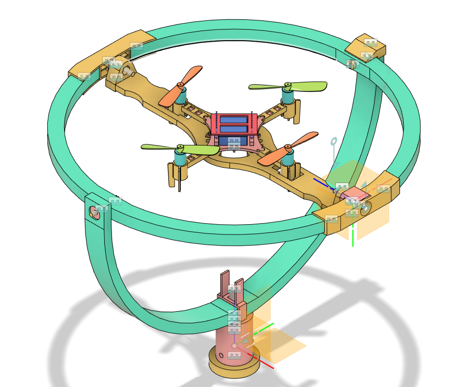
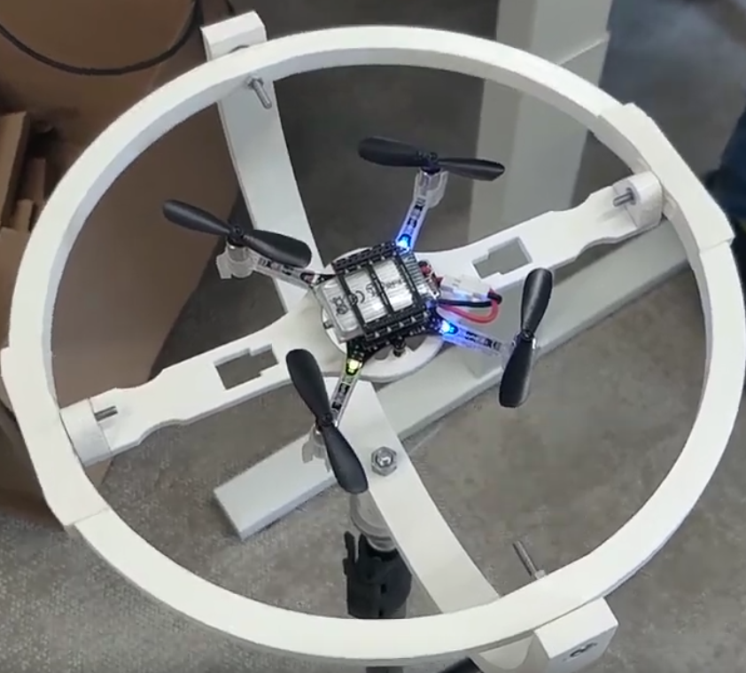

# CrazyFlieGimbal
This is an Open Source 3D Printable Gimbal for nano and micro UAVs. The gimbal was designed to test different control algorithms as part of research activities at the ENS lab at TU Delft. The original work was created in the summer of 2022, using fusion 360 and is made for a CrazyFlie drone. The design is available in both .step and .fbz files. Additionally, the prusa slicer project used to print all components on a prusa MK3S at once is included as well. The design has been tested with a Crazyflie 2.1 and is intended to be attached to a standard tripod screw.

 For assembly, please refer to this [interactive model](https://teamtumbleweed3.autodesk360.com/g/shares/SH35dfcQT936092f0e431fe7335b7a1c18c6).

### Parts

| Component                                                 | Usage            | Qty |
|-----------------------------------------------------------|------------------|-----|
| Ball Bearing Inner d = 3 \| Outer d = 9 \| Thickness = 5  | Inner 2 axes     |   4 |
| Ball Bearing Inner d = 6 \| Outer d = 12 \| Thickness = 4 | Base             |   2 |
|                                                           |                  |     |
| M3 x 0.5 spacer                                           | Inner 2 axes     |   4 |
| DIN 912 M3 x 30mm halfthreaded screw                      | middle axis      |   4 |
| DIN 912 M3 x 20mm halfthreaded screw                      | Inner axis       |   2 |
| DIN 934 M3 hex nut                                        |                  |   8 |
|                                                           |                  |     |
| DIN 912 M2 x 12mm screw                                   | Drone attachment |   2 |
| DIN 912 M2  hex nut                                       | Drone attachment |   2 |
|                                                           |                  |     |
| DIN 912 M6 x 30 mm halfthreaded screw                     | Base Connector   |   1 |
| DIN 934 M6 hex nut                                        | Base Connector   |   1 |
|                                                           |                  |     |
| m2 Threaded insets                                        | Drone attachment |   2 |

### Galery

